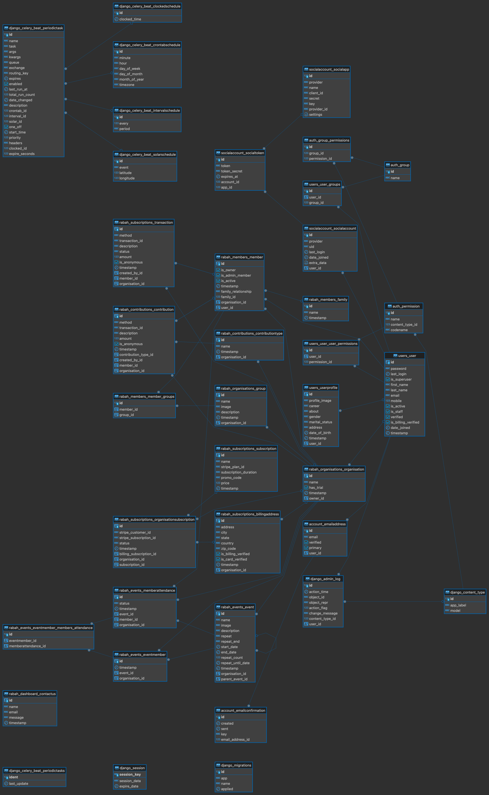

# Rabah - Documentation

# Table of Contents

1. [Rabah - Documentation](#rabah---documentation)
2. [Setting Up for Development](#setting-up-for-development)
    - [Cloning the Repository](#clonning-the-repository)
    - [Change into the project's directory](#change-into-the-projects-directory)
    - [Activate Virtual Environment(Create a virtual environment)](#activate-virtual-environmentcreate-a-virtual-environment)
        - [Using virtualenv](#using-virtualenv)
            - [For Mac/Linux](#for-maclinux)
            - [For Windows](#for-windows)
        - [Using pyvenv (Python 3.x)](#using-pyvenv-python-3x)
        - [Environemt Variables](#environemt-variables)
        - [Install dependencies](#install-dependencies)
        - [Apply database migrations](#apply-database-migrations)
        - [Create a superuser (for Django Admin access)](#create-a-superuser-for-django-admin-access)
        - [Run the development server](#run-the-development-server)
        - [Access the Django Admin](#access-the-django-admin)
        - [Run Celery for background tasks](#run-celery-for-background-tasks)
    - [GitHub Repository](#github-repository)
3. [Database Models](#database-models)

> This first part of the documentation contains instructions on how to run the project locally:

## Setting Up for Development

### Clonning the repository

Using `git ssh`:

```bash
git clone git@github.com:Impact-Technology-Consulting/Rabah.git
```

Using `gh cli`:

```bash
gh repo clone Impact-Technology-Consulting/Rabah
```

### Change into the project's directory

```bash
cd Rabah
```


### Activate Virtual Environment(Create a virtual environment)

#### Using virtualenv

##### For Mac/Linux

First, install virtualenv if you haven't already: 
```bash
pip install virtualenv.
```

Navigate to your project directory in the terminal.
Run the following to create a virtual environment named "venv" (you can replace "venv" with any name you prefer):
```bash
virtualenv venv
```
 
Activate the virtual environment:

On Mac/Linux: 

```bash
source venv/bin/activate
```

Your terminal prompt should now indicate that you are in the virtual environment.

##### For Windows:

Install virtualenv if you haven't already: 

```bash
pip install virtualenv
```

Navigate to your project directory in the command prompt.
Run `virtualenv venv` to create a virtual environment named "venv" (you can replace "venv" with any name you prefer).

Activate the virtual environment:
On Windows: 

```bash
venv\Scripts\activate.
```

Your command prompt should now indicate that you are in the virtual environment.

#### Using pyvenv (Python 3.x)

##### For Mac/Linux/Windows:

Navigate to your project directory in the terminal or command prompt.

Run :

```bash
python3 -m venv venv 
```

to create a virtual environment named "venv" (you can replace "venv" with any name you prefer).

Activate the virtual environment:
On Mac/Linux: 

```bash
source venv/bin/activate
```

On Windows: 

```bash
venv\Scripts\activate
```

Your terminal or command prompt should now indicate that you are in the virtual environment.

### Environemt Variables

Copy content variables from [.env.sample](.env.sample)

```env
DEBUG=
SECRET_KEY=""

EMAIL_PORT=
EMAIL_HOST=
EMAIL_USE_TLS=
EMAIL_HOST_USER=
EMAIL_HOST_PASSWORD=
DEFAULT_FROM_EMAIL=

GOOGLE_CLIENT_ID=
GOOGLE_SECRET_KEY=

POSTGRES_DB=
POSTGRES_USER=
POSTGRES_PASSWORD=
POSTGRES_HOST=
POSTGRES_PORT=

Rabah_INFO_MAIL=
Rabah_CUSTOMER_SUPPORT_MAIL=

STRIPE_TEST_PUBLIC_KEY=
STRIPE_TEST_SECRET_KEY=


CELERY_BROKER_URL=

SENTRY_URL=
```

>Please contact project lead for key variables to use for development testing.

### Install dependencies

```bash
pip install -r requirements.txt
```

### Apply database migrations

For local development, you can use 2 databases:

Default:
```bash
python manage.py migrate
```

Secondary:

```bash
python manage.py migrate --database=secondary // secindary db
```

### Create a superuser (for Django Admin access):

```bash
python manage.py createsuperuser
```

### Run the development server

```bash
python manage.py runserver
```

### Access the Django Admin

- Open your browser and go to [http://127.0.0.1:8000/admin/](http://127.0.0.1:8000/admin/)
- Log in with the superuser credentials created in step 4.

### Run Celery for background tasks

```bash
celery -A Rabah worker --loglevel=info
```

## GitHub Repository

You can find the project on GitHub: [Rabah GitHub Repository](git@github.com:Impact-Technology-Consulting/Rabah.git)


# Database Models




## Template Used on themeforest for landing page 
https://themeforest.net/item/elency-multipurpose-corporate-business-html-template/34385404